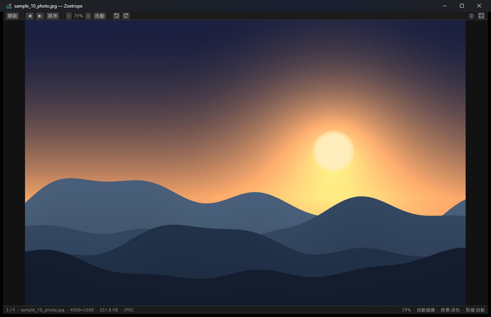
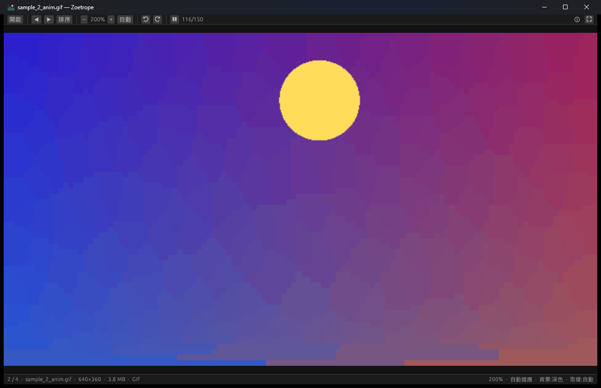

# Zoetrope 走馬燈

[](https://github.com/acer1204/Zoetrope/actions/workflows/ci.yml)
[](LICENSE)
[](https://www.rust-lang.org/)

**極速跨平台看圖軟體** — 以 Rust + egui + wgpu 打造。

專注一件事：**看圖要夠流暢**。開檔即開窗、大 GIF 秒播、萬張資料夾翻頁不卡、
縮放平移零延遲。不做編輯、不做管理，就是純粹把圖看好。
Windows / macOS / Linux 同一套程式碼。

> 名稱取自 19 世紀讓靜止畫面轉動起來的視覺裝置「走馬燈」（zoetrope）。



<p align="center">
  <br>
  <sub>動畫串流解碼——第一格解出就開始播放，其餘影格邊解邊進（工具列顯示 142/150）</sub>
</p>

## 特色

- **啟動即顯示**：視窗立刻出現，所有解碼在背景執行緒，UI 永不被磁碟 I/O 卡住
- **動畫串流解碼**：GIF / 動畫 WebP / APNG 解出第一格就開始播放，其餘影格邊解邊進——
  百 MB 的大 GIF 不必等全部解完
- **資料夾惰性載入**：開一張圖只掃檔名清單（萬張毫秒級），目前圖片與前後 ±2 張
  預先解碼進快取，翻頁瞬間切換
- **零閃爍換圖**：新圖解出第一格才換上畫面，切換過程中不會出現空白或黑幀
- **GPU 渲染**：wgpu 後端（Windows DX12、Linux Vulkan、macOS Metal），
  縮放、平移、旋轉全是 GPU 貼圖操作；`--gl` 可切換 OpenGL 後端
- **Mip 鏈縮圖**：縮小檢視大圖時自動選擇適當解析度層，無鋸齒、無閃爍
- **記憶體有預算**：解碼快取 1.5 GB LRU 淘汰；單一動畫超過 3 GB 自動截斷保護；
  動畫播放共用一張 GPU 貼圖逐格更新，不會吃爆 VRAM
- **廣泛格式**：JPEG（含 EXIF 自動轉向）、PNG / APNG、GIF、WebP（靜態＋動畫）、
  BMP、TIFF、ICO、TGA、QOI、HDR、EXR、PNM、DDS、farbfeld，
  以及 **JPEG XL、AVIF、HEIC/HEIF、相機 RAW**（CR2/CR3/NEF/ARW/DNG…）——
  全部純 Rust 解碼，**不需要安裝任何 C 函式庫或系統擴充功能**；
  Windows 另支援 **JPEG XR**（`.jxr`，遊戲列的 HDR 截圖格式）
- **HDR 正確顯示**：EXR / Radiance HDR / JXR 保留浮點資料，以 ACES 曲線
  色調映射，並提供即時曝光補償（±6 EV，拉滑桿約 5ms，不需重新解碼）
- **膠捲條**：滑鼠移到底部浮出橫向縮圖列，點選即可跳轉。只為可見格子
  產生縮圖，優先用 EXIF 內嵌縮圖與 DCT 縮放解碼，走最低優先權佇列
  以免拖慢翻頁
- **內容偵測**：以檔頭判斷真實格式，副檔名標錯（例如 JPEG 存成 `.png`）也能正常開啟
- **RAW 漸進式載入**：先抽相機內嵌的 JPEG 預覽（13–90ms）立即顯示，
  預覽解析度不足時才在背景補上完整 demosaic 顯影並無縫替換

## 安裝

到 [Releases](https://github.com/acer1204/Zoetrope/releases) 下載編譯好的執行檔，
或依下方說明自行建置。

## 建置

需要 [Rust](https://rustup.rs/)（stable）。

```bash
cargo build --release
```

執行檔產生在 `target/release/zoetrope`（Windows 為 `zoetrope.exe`）。

平台注意事項：

- **Windows**：MSVC 與 GNU 工具鏈皆可。用 GNU 工具鏈（免裝 Visual Studio）時，
  需要完整的 mingw-w64 binutils；rustup 內建的精簡版缺 `as.exe`，
  建議安裝 [WinLibs](https://winlibs.com/)（`winget install BrechtSanders.WinLibs.POSIX.UCRT`）。
- **Linux**：需要 Vulkan 驅動；檔案對話框走 xdg-desktop-portal。
- **macOS**：直接可用（Metal）。

> 若專案路徑含非 ASCII 字元（例如中文資料夾名），GNU 工具鏈的連結器會失敗。
> 解法是在 `.cargo/config.toml` 指定純 ASCII 的 `target-dir`，或改用 MSVC 工具鏈。

## 使用

```bash
zoetrope 圖片.webp        # 開啟單檔（同資料夾自動建立瀏覽清單）
zoetrope 某個資料夾       # 開啟資料夾第一張
zoetrope --gl 圖片.gif    # 改用 OpenGL 後端（遇到顯卡驅動問題時）
```

也可以把檔案拖進視窗。

### 設為 Windows 預設看圖軟體

```powershell
.\register.ps1     # 以目前使用者身分註冊（免系統管理員）
```

執行後 Zoetrope 會出現在「設定 → 應用程式 → 預設應用程式」與右鍵「開啟方式」選單。
最後一步 Windows 規定必須由使用者親自點選（防止軟體綁架關聯）：

- **最快**：對任一張圖右鍵 → 開啟方式 → 選擇其他應用程式 → Zoetrope → 勾「一律使用」
- 或在「預設應用程式」頁搜尋 Zoetrope，逐一指定副檔名

移動過 `Zoetrope.exe` 就重跑一次 `register.ps1`；`unregister.ps1` 可完整移除。

### 快捷鍵

| 鍵 | 功能 |
|---|---|
| 滾輪、`←` `→`（或滑鼠側鍵、PageUp/Dn） | 上一張／下一張 |
| `Home` / `End` | 第一張／最後一張 |
| `Ctrl+滾輪` / 觸控板捏合 | 以游標為中心縮放 |
| 拖曳 | 平移 |
| 雙擊 | 1:1 ↔ 返回選定顯示方式 |
| `0` / `3` / `W` / `H` / `1` | 顯示方式：自動適應／填滿裁切／符合寬度／符合高度／原始大小（工具列選單亦可選，跨圖片保持並記憶） |
| `2` | 200% |
| 工具列「排序」選單、`S` | 排序依據（名稱／修改日期／大小／類型）；`S` 快速切換升降序 |
| 滑鼠移到視窗底部、`T` | 膠捲條：橫向縮圖列，點選跳轉；`T` 釘選顯示 |
| 工具列「HDR」選單 | HDR/EXR/JXR 的曝光補償（±6 EV）與色調映射曲線 |
| 工具列 `？` | 關於（版本、GitHub 連結、繪圖後端） |
| `+` `-` | 縮放 |
| `R` / `Shift+R` | 順／逆時針旋轉 90° |
| `Space` | 動畫播放暫停（靜態圖＝下一張） |
| `,` `.` | 暫停時逐格前進後退 |
| 滑鼠中鍵單擊、`F` / `F11` | 全螢幕開關（中鍵拖曳仍是平移） |
| `I` | 圖片資訊（含快取狀態、繪圖後端） |
| `B` | 切換背景色（深／黑／灰／白） |
| `N` | 取樣方式（自動／平滑／像素） |
| `O` | 開啟檔案 |
| `F5` | 重新載入目前圖片 |
| `Esc` | 離開全螢幕／關閉視窗 |

## 效能架構

```
UI 執行緒（每幀 < 1ms 邏輯）             背景解碼執行緒 ×2~4
┌───────────────────────┐   高優先權佇列   ┌──────────────────────────┐
│ egui + wgpu 渲染       │ ───────────────▶ │ 目前圖片：串流解碼        │
│ 事件驅動重繪            │   低優先權佇列   │ 鄰居 ±2：預解碼           │
│ 動畫排程 request_       │ ───────────────▶ │ 資料夾掃描（只讀檔名）     │
│   repaint_after(delay) │ ◀─────────────── │ 影格一格一事件回傳         │
└───────────────────────┘    事件 channel   └──────────────────────────┘
                 │                                    │
                 ▼                                    ▼
        GPU 貼圖（動畫單張重用；                LRU 位元組預算快取
        靜態圖 mip 鏈按縮放選層）              （generation 作廢機制）
```

關鍵決策：

1. **generation 計數作廢**——快速翻頁時，過時的動畫解碼在影格邊界檢查後立即中止，
   不浪費 CPU 也不污染畫面。
2. **雙緩衝換圖**——新圖在背景緩衝解碼，解出第一格才取代畫面上的舊圖，
   消除切換瞬間的黑畫面。
3. **動畫預載只解第一格**——翻到時秒出畫面，完整解碼同時在背景展開。
4. **貼圖上限保護**——超過 8192px 的圖自動降階上傳（GPU 貼圖上限），
   狀態列縮放比例仍以原始像素為準。
5. **0 延遲 GIF 修正**——延遲 <20ms 的影格按瀏覽器慣例以 100ms 播放。

## 測試

```bash
cargo test                                           # 單元 + 端到端解碼測試
cargo run --release --example gen_samples -- --big   # 產生 samples/ 示範圖組
cargo run --release -- samples                       # 開起來看
```

AVIF 的解碼路徑由測試現場編碼樣本驗證（`ravif`）。
JPEG XL / HEIC / RAW 若要驗證，把樣本檔放進 `tests/assets/` 即會自動納入測試，
說明見 [tests/assets/README.md](tests/assets/README.md)。

## 授權

本專案採 **AGPL-3.0-only**（見 [LICENSE](LICENSE)）。

你可以自由使用、修改、散布與部署；但**散布修改版或以網路服務形式提供時，
必須以相同授權公開完整原始碼**。

之所以是 AGPL 而非寬鬆授權，是因為 HEIC/AVIF 解碼相依 AGPL 元件——
目前沒有授權寬鬆的純 Rust HEVC 解碼器可用。

### 第三方元件

| 套件 | 用途 | 授權 |
|---|---|---|
| [`eframe` / `egui`](https://github.com/emilk/egui) | UI 與 GPU 渲染 | MIT / Apache-2.0 |
| [`image`](https://github.com/image-rs/image) | 主要影像格式 | MIT / Apache-2.0 |
| [`jxl-oxide`](https://github.com/tirr-c/jxl-oxide) | JPEG XL | MIT / Apache-2.0 |
| [`heic`](https://github.com/imazen/heic) | HEIC/HEIF、AVIF | **AGPL-3.0** 或商業授權 |
| [`rawloader`](https://github.com/pedrocr/rawloader) | RAW 解析 | LGPL-2.1 |
| [`imagepipe`](https://github.com/pedrocr/imagepipe) | RAW 顯影管線 | LGPL-3.0 |

> **想做閉源／商業產品？** 可向 [Imazen](https://github.com/imazen/heic) 洽購 `heic` 的商業授權，
> 或移除 HEIC/AVIF 與 RAW 相依，其餘部分即回到寬鬆授權。
>
> **專利提醒**：HEIC 使用的 HEVC 有專利池，商業散布可能涉及權利金；
> AVIF 與 JPEG XL 則免權利金。

## 已知限制

- 超過 **16384px** 的圖以縮小後貼圖顯示（1:1 檢視略軟）。
  這是 GPU 貼圖上限，一般大圖已完全不受影響
- 動畫 AVIF / 動畫 HEIF 只顯示第一格
- JPEG XR 僅 Windows 支援（走系統內建的 WIC）
- 尚無幻燈片模式
